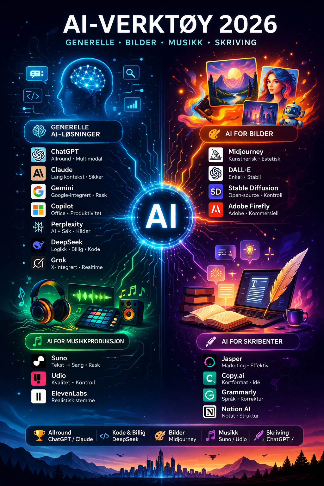
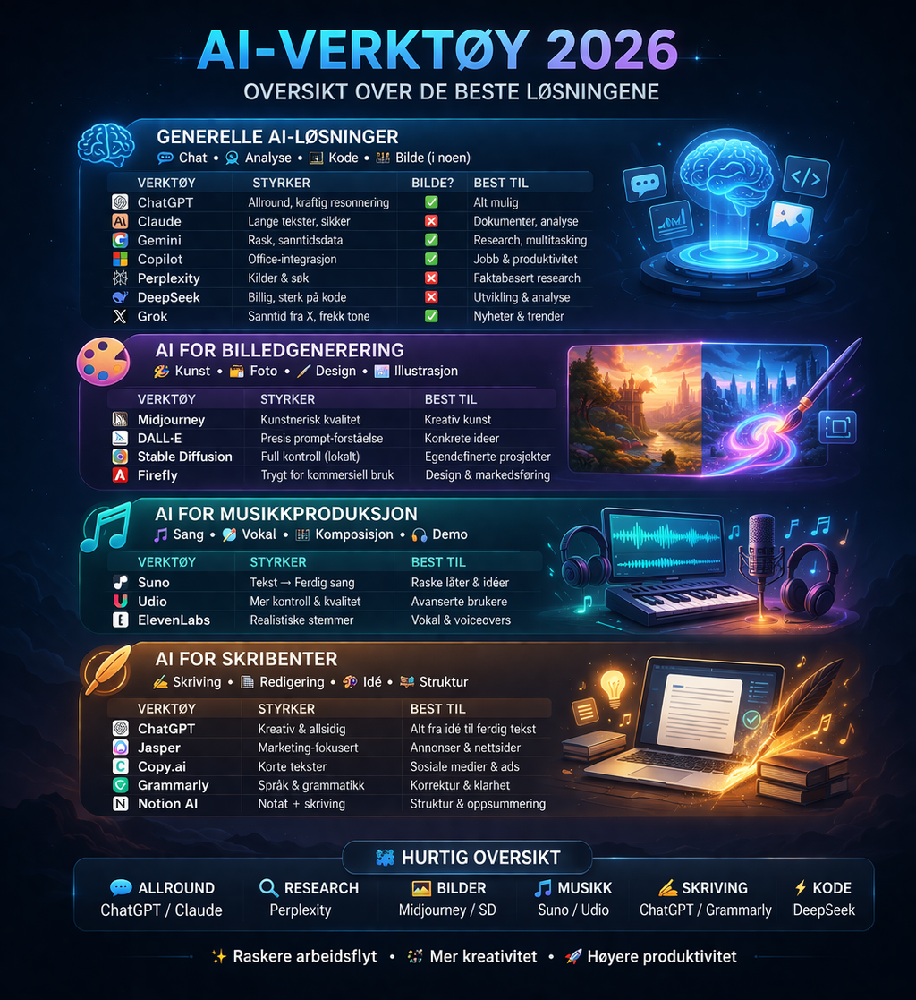

# 🧠 AI-verktøy (2026)

## 🎛️ 1. Generelle AI-løsninger

Her ser vi de kanskje mest vanlige generelle AI-verktøyene i dag:

| Verktøy           | Egenskaper                                   | Pros                                       | Cons                                                            |
| ----------------- | -------------------------------------------- | ------------------------------------------ | --------------------------------------------------------------- |
| ChatGPT           | Allround LLM, multimodal                     | Fleksibel, sterk resonnering               | Hallusinasjoner, premium                                        |
| Claude            | Lang kontekst, sikkerhet                     | God på lange tekster                       | Mindre kreativ                                                  |
| Google Gemini     | Google-integrert, multimodal                 | Sanntidsdata, rask                         | Ujevn kvalitet                                                  |
| Microsoft Copilot | Office-integrasjon                           | Effektiv i jobb                            | Begrenset fleksibilitet                                         |
| Perplexity AI     | AI + søk, kilder                             | Faktabasert, oppdatert                     | Mindre kreativ                                                  |
| DeepSeek (Kina)         | Open/effektiv modell, fokus på logikk/koding | Svært billig, sterk på struktur og analyse | Mindre kreativ, sensur/bias i hosted versjoner ([Wikipedia][1]) |
| Grok (Elon Musk)             | X-integrert, sanntidsdata, “personlighet”    | Oppdatert info, rask, kreativ tone         | Mindre dybde, bias, begrenset tilgang ([LinkedIn][2])           |

---

## 🎨 2. AI for billedgenerering

Noen av de generelle AI-verktøyene kan generere bilder. Det gjelder ChatGPT, 
Google Gemini, Microsoft Copilot og Grok. De øvrige av de nevnte har det ikke.

Her ser vi spesialverktøy for bildegenerering:

| Verktøy          | Egenskaper             | Pros                 | Cons                 |
| ---------------- | ---------------------- | -------------------- | -------------------- |
| Midjourney       | Kunstnerisk, stilfokus | Høy estetikk         | Lite presis kontroll |
| DALL·E           | Prompt-forståelse      | Enkel, stabil        | Mindre “wow”         |
| Stable Diffusion | Open-source, lokal     | Full kontroll        | Teknisk krevende     |
| Adobe Firefly    | Adobe-integrasjon      | Kommersiell trygghet | Mindre kreativ       |

---

## 🎵 3. AI for musikkproduksjon

| Verktøy    | Egenskaper            | Pros         | Cons                 |
| ---------- | --------------------- | ------------ | -------------------- |
| Suno AI    | Tekst → sang          | Rask, enkel  | Lite kontroll        |
| Udio       | Mer kontroll/kvalitet | Bedre lyd    | Uforutsigbar         |
| ElevenLabs | Realistisk stemme     | Høy realisme | Ikke full musikktool |

---

## 🖊️ 4. AI for skribenter

| Verktøy   | Egenskaper      | Pros             | Cons            |
| --------- | --------------- | ---------------- | --------------- |
| Jasper    | Marketingfokus  | Effektiv         | Generisk        |
| Copy.ai   | Kortformat      | Rask idé         | Overfladisk     |
| Grammarly | Språkforbedring | Presis korrektur | Lite kreativ    |
| Notion AI | Notat-integrert | God struktur     | Begrenset kraft |

---

## 🧩 Kort oppsummering

| Behov             | Beste valg                    |
| ----------------- | ----------------------------- |
| Allround AI       | ChatGPT / Claude              |
| Lav kost + kode   | DeepSeek                      |
| Sosial / realtime | Grok                          |
| Research          | Perplexity                    |
| Bilder            | Midjourney / Stable Diffusion |
| Musikk            | Suno / Udio                   |
| Skriving          | ChatGPT / Grammarly           |

---

---

[1]: https://en.wikipedia.org/wiki/DeepSeek_%28chatbot%29?utm_source=chatgpt.com "DeepSeek (chatbot)"
[2]: https://www.linkedin.com/pulse/grok-vs-openai-gemini-meta-deepseek-pros-cons-coach-ifung-3lxsc?utm_source=chatgpt.com "Grok vs OpenAI, Gemini, Meta, DeepSeek (Pro's and Con's)"
