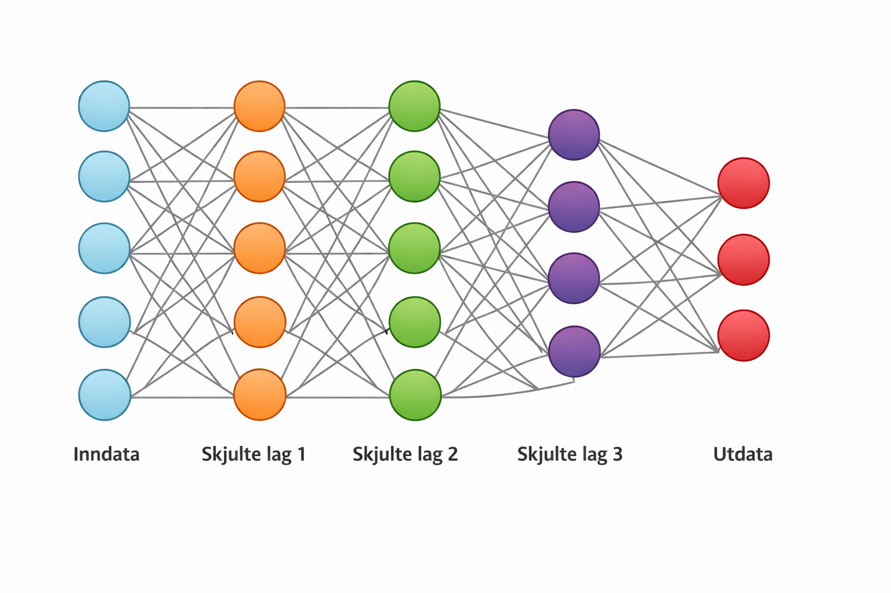
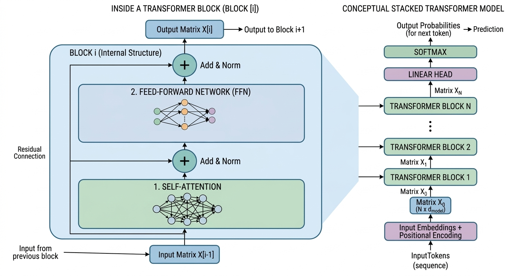

= AI
:stem: latexmath

## Introduksjon

Dette heftet gir en praktisk og strukturert innføring i hvordan moderne AI-modellerer bygget opp og fungerer. Målet å gi en korrekt og konkret forståelse av de viktigste byggesteinene og mekanismene.

Fremstillingen viser først den grunnleggende strukturen til et tradisjonelt nevralt nettverk: noder organisert i lag, koblet sammen gjennom vektede forbindelser. Vi ser der hvordan input-data representeres som vektorer, hvordan disse propagere gjennom nettverket via såkalt *forward flow*, og hvordan resultatet til slutt fremkommer i output-laget. Deretter ser vi nærmere på moderne AI-arkitekturer, blokk- eller transformer-strukturer med attention, residual connections og mere til.

Det gis også en overordnet beskrivelse av hvordan nettverk trenes ved hjelp av feiltilbakeføring (*backpropagation*), der gradienter brukes til å justere vektene.

Heftet ser også på representasjon av tekst gjennom tokens og embedding-vektorer, og til slutt hvordan en chatbot bygger opp sine mer sammensatte svar. Tekstlig input og tekstligemodeller har hovedfokus, men vi ser også litt på bildegenerering og hvordan disse modellene skiller seg fra de tekstbaserte.

Avslutningsvis vises kodeeksempler i Python som demonstrerer hvordan et mindre AI-modeller kan implementeres og kjøres. Eksemplene er bevisst holdt enkle, men dekker likevel de fleste sentrale komponentene i et nettverk.

## Historisk bakgrunn

Utviklingen av kunstig intelligens og nevrale nettverk har skjedd over flere tiår, med perioder både av stor optimisme og stagnasjon. Dagens modeller, som ligger til grunn for moderne chatbots, bygger på en rekke viktige ideer og gjennombrudd.

De første konseptene for nevrale nettverk oppstod allerede på 1940- og 1950-tallet, med enkle matematiske modeller av nevroner. På 1950-tallet ble *perceptronet* introdusert som en av de første lærende modellene. Denne kunne klassifisere enkle mønstre, men hadde klare begrensninger, blant annet manglende evne til å lære mer komplekse sammenhenger.

På 1980-tallet kom et viktig gjennombrudd med gjenoppdagelsen og populariseringen av algoritmen for feiltilbakeføring (*backpropagation*). Dette gjorde det mulig å trene flerlags nevrale nettverk mer effektivt, og la grunnlaget for det som senere ble kjent som *deep learning*.

Gjennom 1990- og 2000-tallet ble nevrale nettverk videreutviklet, blant annet gjennom spesialiserte arkitekturer for bilder og sekvensdata. Samtidig økte tilgjengeligheten av data og regnekraft, noe som var avgjørende for praktisk anvendelse.

Et nytt og avgjørende skritt kom på 2010-tallet, med utviklingen av dype nevrale nettverk som kunne trenes på store datasett. Innen språkbehandling ble først rekurrente nevrale nettverk (RNN) og senere mer avanserte varianter brukt for å håndtere sekvenser av tekst.

Et sentralt gjennombrudd kom med introduksjonen av oppmerksomhetsmekanismer (*attention*), som gjorde det mulig for modeller å vekte ulike deler av input-data forskjellig. Dette kulminerte i publikasjonen Attention Is All You Need fra Google i 2017. Her ble transformer-arkitekturen introdusert, der hele modellens funksjon i stor grad baserer seg på attention-mekanismer, uten behov for rekurrente strukturer.

Transformere har siden blitt grunnlaget for mange moderne språkmodeller. Ved å kombinere store datasett, høy modellkapasitet og effektive treningsmetoder har disse modellene gjort det mulig å utvikle avanserte systemer for tekstgenerering og dialog—det vi i dag kjenner som chatbots.

Denne utviklingen viser hvordan dagens AI-systemer ikke er resultatet av én enkelt idé, men av en gradvis oppbygning av konsepter, algoritmer og teknologiske fremskritt over tid.

Det store gjennombruddet for store språkmodeller kom med lanseringen av ChatGPT 3 i juni 2020. Den etterfulgte ChatGPT 2 som kom i 2019, og var en stor skalering opp og en markant forbedring. Siden kom ChatGPT 4 i mars 2023 og CHatGPT 5 gradvis i 2025/2026. Andre fulgte opp, og f.eks. Gemini fra Google er nå i versjon 2.x som etterfulgte Gemini 1.5 i 2024 og Gemini 1.0 i 2023. Disse etterfulgte versjoner med andre navn (laMDA fra 2021, PaLM fra 2022 og PaLM 2 fra 2023). Og det fins selvsagt mange andre.

Gemini har vært multimodal fra starten (kan håndtere flere typer input og output: tekst, bilder, video og lyd) i motsetning til ChatGPT som ble multimodal først i versjon 4. Gemini er å oppfatte som én modell med flere innganger (for ulike typer input), mens ChatGPT kobler sammen flere modeller, f.eks. ChatGPT + DALL-E for bildehåndtering. 

Arkitekturene i senere modeller holdes gjerne hemmelig, men man er ganske sikre på at de alle er av typen vi etter hvert skal beskrive her:

- transformer-baserte
- bygget opp av:
        - blokker med attention-lag og
        - FFN-lag
        - residual connections
- trenet med nest-token-prediction

men sikkert med utvidelser av størrelse og treningsdata, og med diverse forbedringer. Framtiden vil vise hvordan utviklingen går videre. 

## Tradisjonell AI-arkitektur: Nodenettverk

Før vi går løs på moderne modeller, skal vi se på et mer tradisjonelt nodenettverk, eller et nevralt nettverk. Disse har en del likhetstrekk, og det kan være lurt å bli introdusert til et tradisjonelt nettverk først for å få en føling med ingrediensene uten å måtte fordype seg i for mange detaljer. Tradisjonelle nodenettverk er dessuten fortsatt i bruk og kan løse selv nokså komplekse karakteriseringsoppgaver. Skiftgjenkjennelse er et eksempel på noe relativt små modeller av denne type kan håndtere.

Et tradisjonelt nodenettverk består av noder organisert i lag, der hvert lag er koblet til det neste gjennom vektede forbindelser, også kalt synapser. Figuren nedenfor viser et forenklet nettverk, med et input-lag, tre såkalte skjulte lag og et output-lag. Man sier at dette er et nodenettverk med 4 nivåer (eller har dybde 4). 

I figuren er hver sirkel en node, og linjene mellom nodene representerer synapsene. Til hver synapse assosieres det en vekt, en numerisk verdi (positiv eller negativ), hvilket gir opphav til såkalte vektmatriser for hvert lag. Mer presist, når stem:[n] noder fra laget over forbindes med stem:[m] noder i laget under, får man stem:[m \cdot n] synapser, hvilket gir opphav til en stem:[m \times n]-matrise med vekter. Denne vektmatrisen på nivå stem:[i] betegnes

[stem]
++++
\mathbf{W^{(i)}}
++++

Når nodenettverket kjører (såkalt forward flow), mates en input-vektor (tenk spørsmål) inn i input-nodene og transformeres suksessivt gjennom alle lagene til et resultat (output-vektor) havner i output-nodene (tenk svaret på spørsmålet). I hvert lag utføres matriseoperasjoner mellom vektene og input-vektoren, hvilket resulterer i en ny vektor som så sendes videre til neste lag for tilsvarende sett av beregninger.

Vi skal straks se på flere detaljer, men bør nevne at det knyttes såkalte bias-vektorer stem:[\mathbf{b^{(i)}}] til hvert lag, og disse blandes inn i beregningene.

Når man trener nettverket starter prosessen i motsatt ende (backward flow). Vi skal si mer om dette senere, men kan kort si at det først beregnes en matematisk avstand mellom output-vektor og en vektor som representerer riktig svar, en såkalt tapsfunksjon. Verdien gis som startverdi til backdrop-algoritmen, som er en gradient-basert minimeringsalgoritme som her anvendes på vektrommet (den totale variasjonen av alle vektmatriser, bias-vektorer og andre numeriske parametre). Ved nok slik trening vil alle vektene og øvrige verdier å få gunstige verdier, i den forstand at de er optimalisert for å minimere tapsfunksjonen. I praksis betyr det at modellen svarer riktig ikke bare på den er trent på, men også i nye settinger.

Dette enkle bildet med ett spørsmål og ett svar kan være greit å ha i starten. Men det er klart for chatbots og språkmodeller, er det flere ting må også skje både før, under og etter en kjøring.

Når det gjelder input, som kan omtales likt for både tradisjonelle og moderne modeller, så holder det foreløpig å si at bruker-input via numeriske tokens ender opp som en følge av input-vektorer:

[stem]
++++
\mathbf{x^{(1)}, x^{(2)}, x^{(3)},} \: ... 
++++

Disse vektorene er relativt lange. Dimensjonene varier med anvendelsen, men kan være flere tusen elementer lange. De sendes en etter en gjennom nettverket, og resultatet blir en følge av output-vektorer stem:[\mathbf{y^{(1)}, y^{(2)}, y^{(3)},} \: ...]

La oss nå se på den sentrale kjøringen (forward flow) av et tradisjonelt nodenett. Vi får da illustrert hvordan nodenettverk kan representeres av et antall matriser og kjøres ved ulike matriseoperasjoner.

En input-vektor stem:[\mathbf{x}^{(1)}] prosesseres på følgende måte i denne modellen:

[stem]
++++
\mathbf{z_1} = \sigma ( \mathbf{W}^{(1)} \cdot \mathbf{x_1} + \mathbf{b}^{(1)})
++++

[stem]
++++
\mathbf{z_2} = \sigma ( \mathbf{W}^{(2)} \cdot \mathbf{z_1} + \mathbf{b}^{(2)})
++++

[stem]
++++
\mathbf{z_3} = \sigma ( \mathbf{W}^{(3)} \cdot \mathbf{z_2} + \mathbf{b}^{(3)})
++++

[stem]
++++
\vdots
++++

[stem]
++++
\mathbf{z_k} = \sigma ( \mathbf{W}^{(k)} \cdot \mathbf{z_{k-1}} + \mathbf{b}^{(k)})
++++

Bias-vektorene våre må ha samme størrelsen som output-vektoren fra laget, altså antall noder stem:[m].

Output av input stem:[\mathbf{x_1}] kan vi betegne stem:[\mathbf{y_1}], og er altså lik vektoren stem:[\mathbf{z_k}] vist over. Når denne er beregnet, sendes neste input-vektor stem:[\mathbf{x_2}] inn i samme prosess, og vi ender til slutt opp med en følge stem:[\mathbf{y^{(1)}, y^{(2)}, y^{(3)} ...}] av output-vektorer.

Lag-operasjonene er i bunn og lineære matriseoperasjoner, men med et tilleggsbidrag av en ikke-lineær avbildningen kalt stem:[\sigma], som vi anvendte i lag-operasjonene over. Det er flere slike ikke-lineære avbildninger i praktiske bruk. Her er noen:

* stem:[\text{GELU}: \sigma(x) = x \cdot Φ(x)]

* stem:[\text{ReLU}: \sigma(x) = max(0,x)]

* stem:[\text{SiLU}: \sigma(x) = \frac{x}{1 + e^{-x}}]

* stem:[\text{Sigmoid}: \sigma(x) = \frac{1}{1+ e^{-x}}]

* stem:[\sigma(x) = \text{tanh}(x)]

(der stem:[\phi(x)] er den kumulativ standard-normalfordelingen). stem:[\text{GELU}] er vanligst å bruke i moderne språkmodeller.

Uansett hvilken man velger, er ikke-linearitet helt avgjørende for at et nodenettverk, tradisjonelle såvel som moderne, skal fungere. Uten dette blir alt forutsigbart og dødt. Men det ønskes nokså subtile endringer her, noe som ikke ødelegger vektingen, som kan beregnes effektivt og som samspiller godt med treningsmetodene (backdrop).

Det kan også nevnes at det forskes på andre operasjoner enn rene matriseoperasjoner her (andre effektive operasjoner som også gjør store tall store og små tall små, og som ikke dreper signalene). Polynomer er bl.a. forsøkt.

Dette var forward flow uten attention. Som antydet i historikk-kapittelet (artikkelen All You Need Is Attention), bidrar attention (også kal self-attention) betydelig til kvaliteten av moderne modeller. Men for å forstå hva det er, er det på tide å se nærmere på blokk-baserte AI-modeller og inkludere flere operasjoner.

== Moderne AI-arkitektur: Blokk-strukturer

Moderne arkitekturer har en annen oppbygging enn det nevnte. Man kan godt oppfatte dem som en sammensetning av flere nodenettverk, men det er bedre å tenke på strukturen som bestående av et antall blokker. Hver blokk består av to lag, et attention-lag (også kalt self-attention-lag) og ett feed forward lag (betegnet FFN- eller MLP-lag). Blokkene, som i antall kan være rundt 100 i moderne arkitekturer, er på input-parametre nær like, og er koblet sammen i en sekvens, der output fra én blokk mates som input til neste blokk, til man til slutt ender opp med en output-matrise stem:[\mathbf{Y}] (i figuren betegnet stem:[\mathbf{X_n}] = output fra siste blokk).

Et attention-lag i en transformer-blokk representeres av et sett av tre vektmatriser stem:[\mathbf{W^Q}], stem:[\mathbf{W^K}] og stem:[\mathbf{W^V}]. FFN-laget representeres av noen vektmatriser stem:[\mathbf{W^{(i)}}], samt bias-matrise og ulike normaliseringsparametre.

Merk at moderne litteratur begrepet lag (“layer”) annerledes i enn tradisjonelle lag i nodenettverk. Med dybden av en slik blokkarkitektur mener man antall blokker. Og vanlig dybde for større AI-modeller kan altså være rundt 100.

Chatbots er egentlig designet for å finne nest ord fra en sekvens av ord. De er ikke designet for bare å gi ett svar på ett kort spørsmål, som vi har illustrert situasjonen med til nå. ChatBots besvarer egentlig: "Hva er neste token gitt hele teksten så langt?” Og “hele teksten” inkluderer:
brukerens spørsmål alt modellen selv har generert. Vi skal se på alle detaljer rundt dette og alle konkrete beregninger snart.

== Prompt-tokenisering og strukturering

Forward flow er fortsatt den viktigste delen av en kjøring, men flere ting skjer både før og etter dette. La oss ta det i rekkefølge.

Teksten brukeren skriver inn blir aller først pre-prosessert/vasket. Unødvendige tekst kan bli fjernet, som eventuelle HTML-tags, rare linjeskift og annet, og teksten kan bli ryddet noe opp i. Visse kontroll-tokens og format-annotasjoner vil også bli lagt til av systemet. Start av teksten, separasjon av setninger og markups som tydelig skiller referanse til bruker og assistent, er eksempel på slike annotasjoner.

Etter dette vil neste steg være tilordning av tokens.

== Tokens og embedding-vektorer

Tekst representeres av embedding-vektorer via tokens. En token er en numerisk representasjon av et ord, en del av et ord eller et tegn, avhengig av hvordan modellen er trent. Spørsmålstegn og andre symboler er altså egne tokens, og sammensatte ord deles typisk opp i flere for lettere å reflektere semantikken. Ukjente ord vil bli delt opp, om nødvendig til enkelttegn. Et token fungerer som en indeks eller referanse til en embedding-vektor i en lært/trent modell, en såkalt embedding matrix:

[stem]
++++
\mathbf{W^{embed}}
++++

Embedding-vektorenes verdier blir tilpasset i treningen slik at de fanger opp relasjoner mellom ord og begreper. Ord som er semantisk like, vil (pga. treningen) bli representert av vektorer som ligger nær hverandre i vektorrommet. Avstand eller likhet mellom slike vektorer kan måles på ulike måter. Et vanlig mål er cosinus-likhet, som korresponderer til vinkelen mellom vektorene. Vektorer som peker i lignende retninger vil ha høy cosinus-likhet, og representerer dermed ord med lignende betydning. (Vektorer som peker i liknende retning, vil ha cosinus-verdi nær 1; vektorer som peker i motsatt retning, vil ha verdier nær -1; vektorer som står tilnærmet vinkelrett på hverandre, vil ha cosinus-verdi nær 0.) Hvor i setninger ord forekommer og rekkefølgen av ord har også betydning i denne treningen.

Hver rad i embedding-matrisen tilsvarer ett token i vokabularet. Når et token med indeks 
stem:[i] brukes som input, hentes den tilsvarende vektor i matrisen ut og brukes som input-vektor.

[source,text]
----
Embedding-matrise

Token      →   Vektor (dimensjon d=4)

"hund"     →   [0.2, -0.1, 0.7, 0.3]
"katt"     →   [0.1,  0.0, 0.6, 0.4]
"bil"      →   [0.9, -0.5, 0.1, 0.2]
...

Samlet som matrise:

        ┌─────────────────────┐
hund    │ 0.2  -0.1  0.7  0.3 │
katt    │ 0.1   0.0  0.6  0.4 │
bil     │ 0.9  -0.5  0.1  0.2 │
...     │  .     .    .    .  │
        └─────────────────────┘
----

Dimensjoner og implementasjonsdetaljer i nyere chatbots er ofte hemmelig, men for ChatGPT 3 er disse detaljene kjente. ChatGPT 3 er egentlig en familie av modeller. I den største av disse er lengden av embeddingsvektorer 12 288. Antall token er 50 257. Dvs. at stem:[\mathbf{W^{embed}}] er en stem:[50 \: 257 \times 12 \: 288]-matrise.

Input-vektorene stem:[\mathbf{x^{(i)}}], som kommer fra følgen av tokens, settes sammen til én input-matrise stem:[\mathbf{X}]. Det vil altså si at vektorer for aktuelle tokens i embeddingsmatrisen, blir radene i stem:[\mathbf{X}].

[source,text]
----
Input-matrise X:

       ┌─────────────────────┐
 x1    │ 0.2  -0.1  0.7  0.3 │
 x2    │ 0.1   0.0  0.6  0.4 │
 x3    │ 0.9  -0.5  0.1  0.2 │
...    │  .     .    .    .  │
       └─────────────────────┘
----

Disse radvektorene er viktige å fokusere på. Ved kjøring vil disse rent matematisk foreta en reise i vektorrommet de lever i. Lineære og ikke-lineære operasjoner på matrisen dreier, flytter og strekker vektorene på ulike måter (lineært og ikke-lineært). Særlig er det verdt å merke seg at de fleste matriseoperasjonene endrer vektorene ved faste vekter (vektmatriser), en form for horisontal endring, mens attention-mekanismen endrer vektorene vertikalt, ved at endringene baserer seg på øvrige radvektorer i matrisen. Dette er lurt å ha i mente når man fordyper seg i beregningsdetaljene.

Antall rader i stem:[\mathbf{X}] vil være antall tokens i spørsmålet. Så om vektorlengdene er stem:[12 \: 288] og antall input-tokens er stem:[10], vil stem:[\mathbf{X}] være en stem:[10 \times 12 \: 288]-matrise.

(I virkeligheten er det mer effektivt å velge en rad-antall som bedre reflekter mer effektive datastørrelser som 128, 512 etc, slik at stem:[\mathbf{X}] gjerne paddes med 0'ere).

Det vi kan merke oss med en gang er at moderne arkitektur opererer med matriser gjennom hele forward flow, ikke enkeltvektorer som i tradisjonelle nodenettverk. Modellen produserer i hvert run en output-matrise stem:[\mathbf{Y}] av samme form som input-matrise stem:[\mathbf{X}].

== Moderne forward flow: Transformer blocks

En ChatBot forsøker altså finne beste, neste token (fra de som er angitt og funnet til nå). Den gjør det, som vi skal se, ved å legge embeddingsvektoren tilhørende dette token'et til forrige input-matrise stem:[\mathbf{X}] og dermed produsere en ny input-matrise stem:[\mathbf{X'}] med radvektorer for alle tidligere tokens samt den nye radvektoren.

La oss se nærmere på hva som skjer i en transformer-blokk. Vi følger input-matrise stem:[\mathbf{X}] sin transformasjon gjennom blokken.

Det er (med noe variasjoner i ulike modeller) 6 hovedtrinn i prosessen, hvorav steg 1-4 utgjør det som kalles attention, og som skjer i attention-laget. Dette er altså det som har vist seg så viktig for moderne AI-modeller. Trinn 5 og 6 skjer i FNN-laget, hvilket inkluderer såkalt residual connections. Vi skal først vise beregningene før vi diskuterer betydninger og implikasjoner av beregningene.

=== Attention

==== 1. Opprettelse av projeksjonene Q, K og V

Input-matrise stem:[\mathbf{X}] er en stem:[n×d]-matrise, la oss si. Her er stem:[d] den dimensjonerende størrelsen. Dette er lengden av vektorene (radvektorene) vi opererer med i modellen (opptil stem:[12 \: 288] i ChatGPT 3).

Det første som skjer er at input-matrisen stem:[\mathbf{X}] multipliseres med tre ulike kvadratiske vektmatriser stem:[\mathbf{W^Q}], stem:[\mathbf{W^K}] og stem:[\mathbf{W^V}] av dimensjoner stem:[d×d]. Dette gir oss tre nye stem:[n×d]-matriser, ulike projeksjoner av input-matrisen, som kalles hhv:

- stem:[\mathbf{Q=X⋅W^Q}] (Queries)

- stem:[\mathbf{K=X⋅W^K}] (Keys)

- stem:[\mathbf{V=X⋅W^V}] (Values)

Merk at det disse navnen indikerer språklige roller, som kanskje eller kanskje ikke oppnås for matrisene. Det bør understrekes at disse ikke trenes forskjellig. Eventuelle grammatiske egenskaper er i tilfelle bare en indirekte følge av deres matematiske plassering i formlene og følgene dette får i treningen.

Ordne kommer uansett fra følgende:

- Query: "Dette leter jeg etter i andre ord."

- Key: "Dette er merkelappen min som andre kan lete etter."

- Value: "Dette er informasjonen jeg faktisk bærer på."

men etter mitt og manges syn, er dette primært historiske navn. Det er i hvert fall vanskelig å se at dette følger av matematikken.

Glem heller ikke at disse matrisene er tre projeksjoner av input-matrisen.

==== 2. Relasjoner

Idéen bak attention har å gjøre med at man i sterkere grad enn i tidligere modeller, forsøker å skue tilbake til tidligere tokens i spørsmålet og til nye produserte tokens, når man bestemmer neste token i følgen. Når en input-matrise multipliseres med vektmatriser, så flytter og strekker dette radvektorene fra matrisen i det store vektorrommet, hvilket er vel og bra. Resultatet påvirkes av statiske, godt trenede vekter (såkalte harde vekter), men påvirkes ikke tidligere tokens/input-vektorer, selv om jo stem:[\mathbf{X}] inneholder dette (slik vi føyer embeddingsvektorer til nye tokens til input-matrisene i forkant av hver kjøring). For å få til attention, må vi på en eller annen måte la beregningene se på alle radene (som står i en korrespondanse til alle ordene) i stem:[\mathbf{X}]. Her kommer stem:[\mathbf{Q}], stem:[\mathbf{K}] og stem:[\mathbf{V}] inn, som alle er direkte projeksjoner av stem:[\mathbf{X}] (tenk versjoner av stem:[\mathbf{X}]). Som vi skal se, setter man disse sammen på en måte som oppnår dette. Dette skjer i steg 2, 3 og 4.

Først gjør man

[stem]
++++
\mathbf{Scores} = \frac{\mathbf{Q⋅K^T}}{\sqrt{d_k}}
++++

der man deler på en skaleringsfaktor stem:[\sqrt{d_k})] for stabilitet. Dette gir en stem:[n×n] matrise med såkalte scores-verdier.

Merk at om bruker-spørsmålet bestod av stem:[10] tokens, så blir resultatet en stem:[10×10]-matrise (om vi ser bort fra eventuell padding). Dette har derfor med vår 10 input-tokens å gjøre. Under ser vi et eksempel på resultatmatrisen på dette stadiet i beregningen. På en måte er det en versjon stem:[\mathbf{X}] og stem:[\mathbf{X^T}], men etter at rad-vektorene (som korresponderte til tokens) har blitt endret av harde vektmatriser, dvs. de er flyttet lineært rundt i vektrommet. Vektorene representerer ikke lenger konkrete tokens (i prinsippet kunne de til og med ha representert andre tokens, selv om dette er _ekstremt_ lite sannsynlig), men denne konstellasjonen gjør det mulig for treningen å se/spille på token'ene videre.

Uansett er hvert tall resultat av skalarproduktet mellom en radvektor i stem:[\mathbf{Q}] og en radvektor i stem:[\mathbf{K}] (pga. transponeringen). Tallet er altså relatert til vinkelen mellom vektorene, men ikke helt og fullt siden man ikke har dividert med vektorlengdene (og fått cosinus-vinkel). Tall kan i prinsippet bli relativt store både fordi vinkelen mellom dem er liten eller fordi vektorene er lange f.eks. Negative verdier er fullt mulig her, men er utelatt av hensyn til pen, enkel formatering.

[source, text]
----
Score-matrise S = QKᵀ / √d 

           jeg     så     en    hund   som    løp     i     parken   fordi   den
        ┌────────────────────────────────────────────────────────────────────────┐
jeg     │  1.2    2.1    0.3    1.0    0.5    0.8    0.9     1.1      0.7    0.6 │
så      │  0.5    1.3    1.1    2.5    1.2    1.8    0.4     1.0      0.9    0.3 │
en      │  0.4    0.6    1.2    3.5    1.0    0.5    0.3     0.4      0.8    0.2 │
hund    │  0.6    1.1    1.0    2.2    1.6    1.2    0.5     0.6      1.0    0.9 │
som     │  0.5    1.0    0.7    2.0    1.1    2.1    0.4     0.5      0.9    0.8 │
løp     │  0.4    0.9    0.6    2.8    1.2    2.3    0.3     0.5      0.8    0.4 │
i       │  1.0    1.2    0.5    1.1    0.6    1.0    1.1     2.0      0.9    1.0 │
parken  │  0.6    1.0    0.5    1.2    0.6    1.1    1.0     2.1      1.5    0.9 │
fordi   │  0.5    0.6    0.5    2.1    1.0    1.1    0.4     1.0      1.2    2.0 │
den     │  0.4    0.5    0.5    3.2    1.1    1.6    0.3     0.4      0.9    1.0 │
        └────────────────────────────────────────────────────────────────────────┘
----

Tallene sier trolig noe om hvor nærme token som "hund" og "parken" er i situasjonen, eller kanskje hvor mye det ene påvirker det andre. Men som så ofte før, man bør være litt kritisk til å hoppe på språklige karakteriseringer for raskt. Beregningene sier egentlig noe om retningen mellom vektorene for token'ene etter at vektorene har blitt flyttet, dreid og strukket i vektorrommet via trente vekter. Man legger sånn sett tilrette for at treningen kan premiere grammatikalske versjoner av "nærhet" og "påvirkning", men man kan ikke ta for gitt at AI opererer slik.

==== 3. Softmax (Sannsynlighetsvekter)

Vi kjører deretter disse skårene radvis gjennom en stem:[\text{Softmax}]-funksjon. Dette tvinger tallene til å bli mellom 0 og 1, og summen av hver rad blir 1.0 (altså en sannsynlighetfordeling i hver rad).

[stem]
++++
\mathbf{A} = \text{softmax}(\mathbf{Scores})
++++

Minner om at stem:[\text{Softmax}] av en vektor stem:[\mathbf{v} = [v_1, v_2, \ldots, v_n]] beregnes slik:

[stem]
++++
v_{i} = \frac{e^{v_{i}}}{\sum_{j=1}^n e^{v_{j}}}
++++

Her ser vi et eksempel på matrisen i dette steget i beregningen:

[source, text]
----
Attention-matrise A (10 × 10):

          jeg     så     en    hund   som    løp     i    parken    fordi  den
        ┌────────────────────────────────────────────────────────────────────────┐
jeg     │ 0.10   0.20   0.05   0.10   0.05   0.10   0.10   0.10     0.10   0.10  │
så      │ 0.05   0.10   0.10   0.20   0.10   0.15   0.05   0.10     0.10   0.05  │
en      │ 0.05   0.05   0.10   0.40   0.10   0.05   0.05   0.05     0.10   0.05  │
hund    │ 0.05   0.10   0.10   0.20   0.15   0.10   0.05   0.05     0.10   0.10  │
som     │ 0.05   0.10   0.05   0.20   0.10   0.20   0.05   0.05     0.10   0.10  │
løp     │ 0.05   0.10   0.05   0.25   0.10   0.20   0.05   0.05     0.10   0.05  │
i       │ 0.10   0.10   0.05   0.10   0.05   0.10   0.10   0.20     0.10   0.10  │
parken  │ 0.05   0.10   0.05   0.10   0.05   0.10   0.10   0.20     0.15   0.10  │
fordi   │ 0.05   0.05   0.05   0.20   0.10   0.10   0.05   0.10     0.10   0.20  │
den     │ 0.05   0.05   0.05   0.35   0.10   0.15   0.05   0.05     0.10   0.10  │
        └────────────────────────────────────────────────────────────────────────┘
----

Merk at vi med de radvise stem:[\text{softmax}]-operasjonene også har tvunget fram en forskjell mellom rader og kolonner i denne kvadratiske matrisen. Verdien i f.eks. posisjon (2, 5) betyr noe annet enn verdien i posisjon (5, 2). Mange sier litt for lettvint (etter min mening) at det første betyr at sannsynligheten der måler hvor relevant token 5 er for token 2 (og motsatt for det andre). Igjen kan det hende at dette blir en følge gjennom trening, men det er ikke gitt fra matematikken at det blir slik. Vi har imidlertid tvunget fram en usymmetri som treningen _kan_ gi en f.eks. en slik betydning.

==== 4. Vektet sum (Kontekstualisering)

Vi bruker så attention-matrisen som vekter (de kalles soft weights, siden de ikke er statiske (harde), men dynamisk bestemt) på stem:[\mathbf{V}]-matrisen:

[stem]
++++
\mathbf{Z} = \mathbf{A} \cdot \mathbf{V}
++++

Og med dette er attention-mekanismen i denne blokken ferdig, og matrisen stem:[\mathbf{Z}] er klar for å sendes videre til FFN-laget i blokken. Men la oss først se nærmer på hva vi egentlig har produsert her. stem:[\mathbf{Z}] blir en stem:[10 \times d]-matrise, f.eks. en stem:[10 \times 12 \: 208]-matrise. Første radvektor i stem:[\mathbf{Z}] blir f.eks.

[stem]
++++
z_{1,1} = a_{1,1} \cdot v_{1,1} + a_{1,2} \cdot v_{2,1} + \ldots + a_{1,10} \cdot v_{10,1}
++++ 

[stem]
++++
z_{1,2} = a_{1,1} \cdot v_{1,2} + a_{1,2} \cdot v_{2,2} + \ldots  + a_{1,10} \cdot v_{10,2}
++++ 

[stem]
++++
\ldots 
++++ 

[stem]
++++
z_{1, \: 12 \: 208} = a_{1,1} \cdot v_{1,\: 12 \: 208} + a_{1, \: 12 \: 208} \cdot v_{2,2} + \ldots  + a_{1,10} \cdot v_{10, \: 12 \: 208}
++++

Koeffisientene stem:[a_{i,j}] her er nettopp sannsynlighetsverdiene (radene) i attention-matrisen vi har eksemplifisert. Radvektoren vi ser her representerer altså en vektor i det store vektorrommet med koeffisienter med slike koeffisienter. Konkrete språknære tolkninger av denne bør man også i utgangspunktet være forsiktig med. Det som imidlertid _er_ sikkert, er at vi har utført en tydelig en form for vertikal operasjon, en attention-operasjon (transformerte stem:[\mathbf{X}]-verdier er unyttet som soft weights i bestemmelsen av stem:[\mathbf{Z}]). Verdiene er sterkt avhengig av hvilke tokens som er behandlet til nå. Håpet er altså at nye tokens som produseres med dette er bedre knyttet til ord og setninger som kommer før det, og dermed gjør modellen bedre egnet.

=== FFN-laget

Det er et par ulike varianter for FFN-laget, gjerne kalt Post-LN og Pre-LN.  Alle modeller inkluderer residual connection, layer norm og feed forward, men de kan variere litt i rekkefølge og antall. Variantene kan skisseres slik: 

[source,text]
----
Post-LN:

Input x
   │
   ▼
┌──────────────────────┐
│   Attention          │
└──────────────────────┘
   │
   ▼
(+ residual: X + Attn)
   │
   ▼
LayerNorm
   │
   ▼   (kalles x₁)
┌──────────────────────┐
│        FFN           │
│ (Feed Forward Net)   │
└──────────────────────┘
   │
   ▼
(+ residual: x₁ + FFN)
   │
   ▼
LayerNorm
   │
   ▼
Output
----

eller

[source,text]
----
Pre-LN:

Input x
   │
   ▼
LayerNorm
   │
   ▼
┌──────────────────────┐
│   Self-Attention     │
└──────────────────────┘
   │
   ▼
(+ residual: x + Attn)
   │
   ▼   (kalles x₁)
LayerNorm
   │
   ▼
┌──────────────────────┐
│        FFN           │
└──────────────────────┘
   │
   ▼
(+ residual: x₁ + FFN)
   │
   ▼
Output
----

Sistnevnte er den som benyttes i ChatGPT. Vi beskriver her førstnevnte variant for rene å skille de to lagene fra hverandre, men det erenkelt å gå fra den ene til den andre fra bestanddelene som beskrives i fortsettelsen.

==== 5. Residual Add & Layer Norm (Stabilitet)

Det første man da gjør i neste steg er å utføre en resudial connection. For FFN-laget i første blokk legger man den opprinnelige stem:[\mathbf{X}] til resultatet stem:[\mathbf{Z}]. Tanken bak er å inkludere tidligere versjon av en matrise i beregningen for å hindre at "signalet" (informasjon) dør ut.

I etterfølgende blokker er det output-vektoren fra forrige blokk som benyttes som input-matrise her.

Deretter normaliserer tallene slik at de har et gjennomsnitt på 0 og et standardavvik på 1.

[stem]
++++
\mathbf{X_{mid}} = \text{LayerNorm}(\mathbf{Z} + \mathbf{X})
++++

Funksjonen stem:[\text{LayerNorm}] (Layer Normalization) er en kritisk komponent for å holde matematikken stabil. Uten denne ville tallene i matrisen enten vokst seg gigantiske eller krympet til null etter 12 blokker, noe som gjør det umulig for modellen å lære. For en vektor stem:[\mathbf{x}] med dimensjon stem:[d], beregnes LayerNorm slik:

[start=1]
1. Finner gjennomsnittet (stem:[\mu]):

[stem]
++++
\mu = \frac{1}{d} \sum_{i=1}^{d} x_i
++++

[start=2]
1. Finner variansen (stem:[\sigma^2]):

[stem]
++++
\sigma^2 = \frac{1}{d} \sum_{i=1}^{d} (x_i - \mu)^2
++++

[start=3]
1. Normaliser vektoren:

[stem]
++++
{\hat{x}_i} = \frac{x_i - \mu}{\sqrt{\sigma²+\epsilon}}
++++

Man legger ofte til et bittelite tall stem:[\epsilon] (f.eks. stem:[10^{-5}]) for å unngå divisjon med null.

[start=4]
1. Skalerer og forskyver vektoren:

For at modellen skal kunne juster normaliseringen basert på læring, legger den til to egne parametere for hvert lag: stem:[\gamma]  og stem:[\beta], som så er gjenstand for trening. Dette gjeninnfører fleksibilitet/læring på dette punktet (siden normaliseringen var fast):

[stem]
++++
y_i = \gamma \cdot \hat{x}_i + \beta
++++

==== 6. Prosessering

Til slutt går hver rad i stem:[\mathbf{X_{mid}}] gjennom et lite nodenettverk helt uavhengig av de andre radene. Dette består vanligvis av to lineære lag og en aktiveringsfunksjon (som stem:[\text{ReLU}] eller stem:[\text{GeLU}]).

[stem]
++++
\mathbf{H} = \text{ReLU}(\mathbf{X_{mid}} \cdot \mathbf{W^{(1)}} + \mathbf{b_1})
++++

[stem]
++++
\mathbf{X_{out}} = \text{LayerNorm}(\mathbf{X_{mid}} + (\mathbf{H} \cdot \mathbf{W^{(2)}} + \mathbf{b_2}))
++++

Disse beregningene gjentas gjennom hver blokk, som er like i struktur, men som har sine egne parametre, egne vektmatriser osv. Output fra hvert lag føres inn som input til neste lag til vi får ut output-matrisen stem:[\mathbf{Y}] fra siste blokk.

== Etter forward flow: Sampling og dekoding

Chatbots ikke bare leverer ett svar, men forsøker å finne beste/mest sannsynlige neste token i følge av tokens. Dette er det grunnleggende i hvordan chatbots produserer sine sammensatte svar. Etter at input-matrise stem:[\mathbf{X}] av modellen har blitt transformert til output-matrise stem:[\mathbf{Y}] av samme form, tar man siste rad fra denne og prosesserer videre. I eksempelet vårt med 10 input-tokens, tar man altså ut en kopi av tiende rad stem:[\mathbf{y^{10}}]. Det høres kanskje naturlig ut at man tar utgangspunkt siste rad for å finne neste token, men det er bare på grunn av at treningen baserer seg på dette at dette er optimalt. Hver en rad i stem:[\mathbf{Y}] startet reisen som en vektor tilhørende input-token'et og har nå endt som en annen vektor i vektorrommet basert på hauger av trenede input-parametre, attention-mekanismer og alt. Det er i utgangspunktet ikke sikkert at siste radvektor sånn sett har mer å fortelle om neste token enn andre radvektorer, men treningen sørger altså for det.

Noen modeller legger til en 11'te radvektor med tilfeldig innhold intielt isteden, og tar 11'te radvektor i stem:[\mathbf{Y}] som utgangspunkt for neste token. Det høres kanskje mer naturlig ut, men forskjellen har tydeligvis ikke så mye å si.

Detaljene videre er som følger. Man har en vokabular-matrise. I moderne modeller er dette den samme store, trente matrisen (embeddings-matrisen) vi har snakket om før. Denne inneholder alle tokens i vokabularet og tilhørende input-vektorer. Denne matrisen betegnes i denne fasen som

[stem]
++++
\mathbf{W_{vocab}}
++++

Man multipliserer denne med stem:[\mathbf{y^{10}}]:

[stem]
++++
\mathbf{logits} = \mathbf{W_{vocab}} \cdot \mathbf{y^{(10)}}
++++

Resultatet, som gjerne kalles, stem:[\mathbf{logits}] blir f.eks. en stem:[50 \: 000]-vektor
(om 50 000 tokens er definert). Hvert element i vektoren er skalarproduktet av radvektorene for hvert token i vokabular-matrisen og stem:[\mathbf{y^{10}}], og dette  korresponderer altsåmed vinkelen mellom dem. Store positive verdier indikerer at de peker i liknende retning.

Dette gjøres så om til sannsynligheter med en stem:[\text{softmax}]-operasjon:

[stem]
++++
p_{i} = \frac{e^{logit_{i}}}{\sum_{j=1}^n e^{logit_{j}}}
++++

Dvs. radvektorer i vokabular-matrisene som ligger nærmest (i retning) til stem:[\mathbf{y^{10}}], får høy sannsynlighet. Man foretar så en trekning basert på denne sannsynligheten, slik at tokens tilhørende vektorer som peker i samme retning som stem:[\mathbf{y^{10}}] har størst sannsynlighet for å bli trukket ut. Siden man foretar en trekning, velger ikke modellen samme token hver gang fra samme input, og modellen svarer stort sett unikt på spørsmål.

== Programmeringseksempel

Ikke ferdig